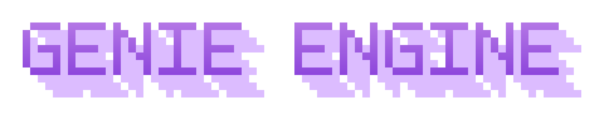

  

  
  

**GenieEngine** is an AI-powered game engine that lets you build commercial-quality video game with AI. Games are real [Godot 4](https://godotengine.org) projects under the hood, and
the AI assistant is powered by the [OpenCode](https://opencode.ai) CLI. Everything — the engine,
git, and the AI agent — ships inside the app, so there's nothing to install or configure beyond
an API key.

*GenieEngine is capable of creating commercial-grade games. [Play demo here](https://legojazz.itch.io/survival-fortress).*

## Free and Open Source

GenieEngine is completely free and open source under the permissive GPLv3 license. No strings
attached, no royalties. Games you create are yours. We follow the very permissive Open Source model
of Godot, which is a key technology that enables GenieEngine.

## Quick Install

| Platform | Download |
| --- | --- |
| macOS (Apple Silicon & Intel) | [OpenGenie.dmg](https://github.com/GenieEngine/GenieEngine/releases/download/v0.1.1/GenieEngine-0.1.1-arm64.dmg) |
| Windows | [OpenGenie-Setup.exe](https://github.com/GenieEngine/GenieEngine/releases/download/v0.1.1/GenieEngine.Setup.0.1.1.exe) |  Note: I don't have a Windows machine, so this is untested
| Linux | [OpenGenie.AppImage](https://github.com/GenieEngine/GenieEngine/releases/download/v0.1.1/GenieEngine-0.1.1.AppImage) |  Note: I don't have a Linux machine, so this is untested

## Why GenieEngine (vs. a coding agent like Claude Code)

Claude Code and OpenCode are excellent general-purpose coding agents — but they assume you already
have a dev environment, are comfortable in a terminal, can easily create art assets, and can wire
up a game engine and an export process yourself. GenieEngine uses that same class of AI agent, but
packages it for one job: making a game.

- **The AI tests its own work** — through a built-in MCP harness, the assistant can run the game
  off-screen, send scripted input, take screenshots, and query game state — so it catches broken
  changes before telling you it's done, instead of you finding out later. You spend less time
  debugging, and more time in the creative process.

- **Art, not just code** — 2D and 3D asset generation is built into the same chat, so sprites,
  icons, and models land straight in your project alongside the code that uses them. Note: I plan
  to add audio (music and sound effects) generation in the future as well.

- **One-click export** — ship to all six Godot platforms without touching an export pipeline
  yourself (MacOS, Linux, Windows, iOS, Android, Web).

Claude Code is the right tool if you're a developer who wants an agent inside your existing
workflow. GenieEngine is for anyone who wants to make a game, with the same caliber of AI doing the
work end-to-end.

## Getting started

### 1. Install and create a project

Install GenieEngine and open it. From the welcome screen, click **New Game**.

### 2. Connect your AI assistant

On first launch, GenieEngine shows a **Connect your AI assistant** screen (reopen it any time via
the gear icon in the title bar). It has three tabs:

**Models** — required; the model slots that power the assistant. Each slot takes any
OpenAI-compatible **API endpoint** (defaults to **OpenRouter**, `https://openrouter.ai/api/v1`), a
**Model**, an **API key**, and **Thinking** / **Reasoning effort** settings. Grab a key from
[openrouter.ai/keys](https://openrouter.ai/keys) and paste it into the Medium slot — the Large and
Image slots reuse it if you leave theirs blank. Recommended setup:

| Slot | What it does | Recommended model | Thinking | Reasoning effort |
| --- | --- | --- | --- | --- |
| **Chat model — Medium** | The everyday model that plans and writes your game's code | `deepseek/deepseek-v4-flash` | Enabled | Max |
| **Chat model — Large** | A heavyweight model for tough tasks — switch to it from the dropdown in the chat box | `deepseek/deepseek-v4-pro` | Enabled | Max |
| **Image model** | Reads images you attach and play-tests your game with screenshots — must accept image input | `moonshotai/kimi-k2.7-code` | Enabled | Max |

**Asset generation** *(optional)* — two more tabs let the assistant create art straight into your
project's assets folder:

| Tab | What it enables | Credentials |
| --- | --- | --- |
| **2D Asset Generation** | Sprites, icons, and UI as transparent 1024×1024 PNGs, via OpenAI's gpt-image-1.5 | OpenAI API key from [platform.openai.com/api-keys](https://platform.openai.com/api-keys) |
| **3D Asset Generation** | 3D models, via Tencent's Hunyuan 3D | **Tencent SecretId** and **SecretKey** from the Tencent Cloud console, under Access Management (CAM) → API Keys — see [Tencent's Hunyuan-to-3D docs](https://www.tencentcloud.com/document/product/1284/75287) |

Skipping a tab just disables that capability; the assistant will explain what it can't do rather
than failing silently.

### 3. Build your game

Describe what you want in the chat — the assistant writes the code, and you can hit **Run** any
time to play the current build right in the window. Ask it for art (2D or 3D) too ("give the player a
pixel-art sprite").

### 4. Shipping your game

When you're ready to ship, click **Export** and pick any combination of Godot's six platforms —
Godot's export templates download automatically the first time you export: **Windows**, **macOS**, 
**Linux**, **Web**, **Android**, and **iOS**.
