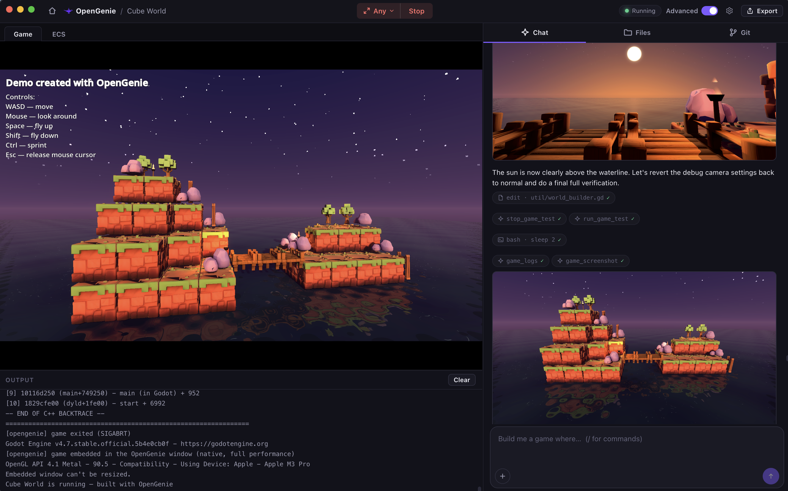
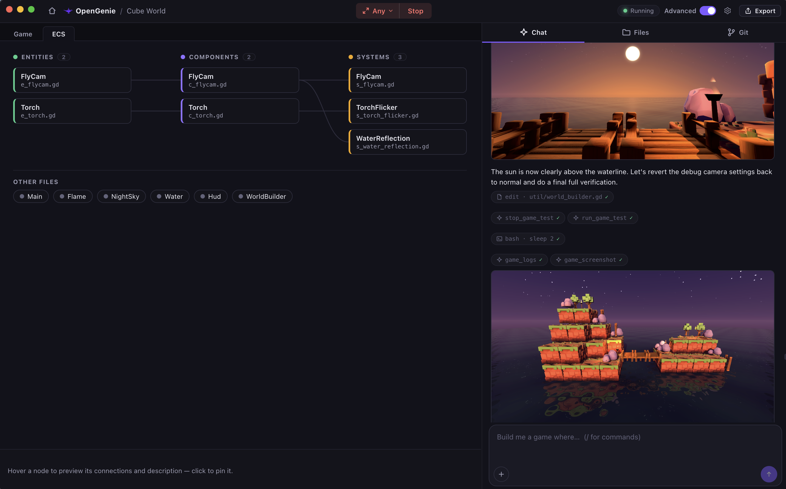

# OpenGenie

OpenGenie is an AI-powered game engine that lets anyone build a real video game by describing it
in plain language. Games are real [Godot 4](https://godotengine.org) projects under the hood, and
the AI assistant is powered by the [OpenCode](https://opencode.ai) CLI. Everything — the engine,
git, and the AI agent — ships inside the app, so there's nothing to install or configure beyond
an API key.

*OpenGenie automatically tests your game, so you spend less time debugging, and more time in the
creative process of creating your game. [Play demo here](https://legojazz.itch.io/cube-world-opengenie-demo).*

## Free and Open Source

OpenGenie is completely free and open source under the permissive GPLv3 license. No strings
attached, no royalties. Games you create are yours. We follow the very permissive Open Source model
of Godot, which is a key technology that enables OpenGenie.

## Why OpenGenie (vs. a coding agent like Claude Code)

Claude Code and OpenCode are excellent general-purpose coding agents — but they assume you already
have a dev environment, are comfortable in a terminal, can easily create art assets, and can wire
up a game engine and an export process yourself. OpenGenie uses that same class of AI agent, but
packages it for one job: making a game.

- **Zero setup** — Godot, git, and the AI agent all ship inside the app. No terminal, no installing
  an engine, no build pipeline to configure. Batteries fully included.

- **The AI tests its own work** — through a built-in MCP harness, the assistant can run the game
  off-screen, send scripted input, take screenshots, and query game state — so it catches broken
  changes before telling you it's done, instead of you finding out later. You spend less time
  debugging, and more time in the creative process.

- **Art, not just code** — 2D and 3D asset generation is built into the same chat, so sprites,
  icons, and models land straight in your project alongside the code that uses them. Note: I plan
  to add audio (music and sound effects) generation in the future as well.

- **One-click export** — ship to all six Godot platforms without touching an export pipeline
  yourself (MacOS, Linux, Windows, iOS, Android, Web).

Claude Code is the right tool if you're a developer who wants an agent inside your existing
workflow. OpenGenie is for anyone who wants to make a game, with the same caliber of AI doing the
work end-to-end.

## Download

| Platform | Download |
| --- | --- |
| macOS (Apple Silicon & Intel) | [OpenGenie.dmg](https://github.com/legojazz/OpenGenie/releases/download/v0.1.0/OpenGenie-0.1.0-arm64.dmg) |
| Windows | [OpenGenie-Setup.exe](https://github.com/legojazz/OpenGenie/releases/download/v0.1.0/OpenGenie.Setup.0.1.0.exe) |  Note: I don't have a Windows machine, so this is untested
| Linux | [OpenGenie.AppImage](https://github.com/legojazz/OpenGenie/releases/download/v0.1.0/OpenGenie-0.1.0.AppImage) |  Note: I don't have a Linux machine, so this is untested

## Getting started

### 1. Install and create a project

Install OpenGenie and open it. From the welcome screen, click **New Game** to scaffold a fresh
project (and choose where its source lives), or **Open** to load an existing one.

### 2. Connect your AI assistant

On first launch, OpenGenie shows a **Connect your AI assistant** screen (reopen it any time via
the gear icon in the title bar). It has three tabs:

**Coding Agent** — required; this is the agent that writes your game's code and logic.

- Defaults to **OpenRouter** (`https://openrouter.ai/api/v1`) with the `moonshotai/kimi-k2.7-code`
  model. Grab a key from [openrouter.ai/keys](https://openrouter.ai/keys), paste it into
  **API key**, and you're ready to go. Note: I've tested kimi-k2.7-code and claude-sonnet-5, and
  both work quite well.

- To use a different provider instead — OpenAI directly, or any other OpenAI-compatible endpoint —
  just change **API endpoint** and **Model** and supply that provider's key.

**2D Asset Generation** *(optional)* — lets the assistant generate sprites, icons, and textures
straight into your project.

- Add an OpenAI API key from [platform.openai.com/api-keys](https://platform.openai.com/api-keys).

**3D Asset Generation** *(optional)* — lets the assistant generate 3D models straight into your
project via Tencent's Hunyuan 3D.

- Add your **Tencent SecretId** and **SecretKey**. These come from the Tencent Cloud console, under
  Access Management (CAM) → API Keys — see [Tencent's Hunyuan-to-3D docs](https://www.tencentcloud.com/document/product/1284/75287)
  for the API this powers.

Skipping a tab just disables that capability; the assistant will explain what it can't do rather
than failing silently.

### 3. Build your game

Describe what you want in the chat — the assistant writes the code, and you can hit **Run** any
time to play the current build right in the window. Ask it for art (2D or 3D) too ("give the player a
pixel-art sprite").

*OpenGenie builds your games using best practices. See creation of an
[entity-component-system](https://en.wikipedia.org/wiki/Entity_component_system).*

### 4. Shipping your game

When you're ready to ship, click **Export** and pick any combination of Godot's six platforms —
Godot's export templates download automatically the first time you export:

- **Windows** — a standalone `.exe`
- **macOS** — a `.zip` containing a signed `.app` bundle
- **Linux** — a standalone `.x86_64` binary
- **Web** — an `index.html` you can drop on any static host and play in the browser
- **Android** — an `.apk` (needs the Android SDK installed)
- **iOS** — an `.ipa` (needs Xcode, macOS only)

Desktop and Web exports work out of the box with no extra setup. Android and iOS need their
platform SDKs installed locally, since those are Apple's and Google's own toolchains to sign and
build against — OpenGenie surfaces Godot's own error messages if a step is missing. Every export
shows up in the project's `exports/<platform>/` folder, ready to upload or hand to someone else to
play.
